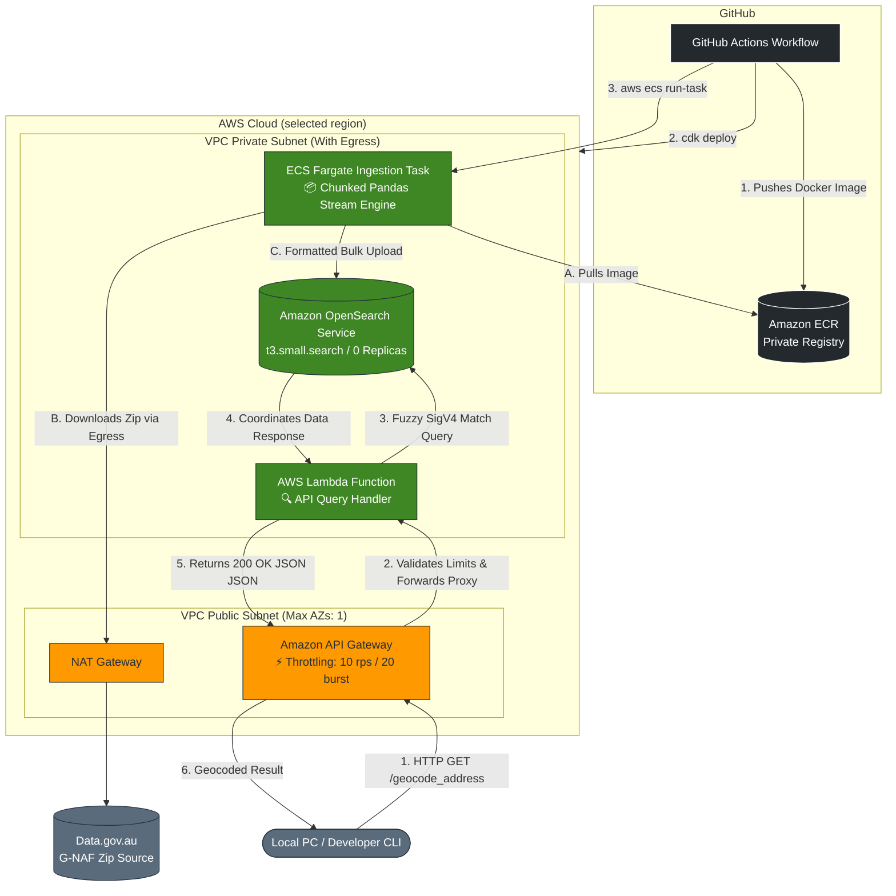

# Geocoder
Geocode Australia address from raw text

Users can deploy this to there AWS Account with their Account ID and URL to latest GNAF dataset.

    
## Pipeline
- To download the large GNAF dataset, run a Fargate container. Stream to download to manage RAM
- Process one state at a time and upload to OpenSearch
- OpenSearch handels the address matching and similarity

When deployed, users will recieve a API Gateway URL.
When requests are received they are sent to a lambda function which queries OpenSearch and returns the matches.

The endpoint to send requests is:
curl -X POST 

## Deploying the App
Your PC will need:
- Python
- awscli-2
- Either Docker OR nodejs (nodejs is needed for aws cdk. If not avalible, you can use the Docker.dev container)

### To install awscli-2 (In PowerShell)
Invoke-WebRequest -Uri "https://awscli.amazonaws.com/AWSCLIV2.msi" -OutFile "$env:USERPROFILE\Downloads\AWSCLIV2.msi"
msiexec /a "$env:USERPROFILE\Downloads\AWSCLIV2.msi" /qb TARGETDIR="$env:USERPROFILE\awscli"
Set-Alias -Name aws -Value "$env:USERPROFILE\awscli\Amazon\AWSCLIV2\aws.exe"
aws configure

# Create the repo
aws ecr create-repository --repository-name gnaf-processor --region ap-southeast-2

# Log your local Docker into your private AWS Registry
aws ecr get-login-password --region ap-southeast-2 | docker login --username AWS --password-stdin <YOUR_ACCOUNT_ID>.dkr.ecr.ap-southeast-2.amazonaws.com

# Build, tag, and push!
docker build -t gnaf-processor:latest .
docker tag gnaf-processor:latest <YOUR_ACCOUNT_ID>.dkr.ecr.ap-southeast-2.amazonaws.com/gnaf-processor:latest
docker push <YOUR_ACCOUNT_ID>.dkr.ecr.ap-southeast-2.amazonaws.com/gnaf-processor:latest

## Build build dev container
docker build -t geocoder-dev -f Dockerfile.dev .

## To run the dev container (if awscdk not installed on your PC)
docker run -it -v ${PWD}:/app -e AWS_ACCESS_KEY_ID=your-key -e AWS_SECRET_ACCESS_KEY=your-secret-e AWS_DEFAULT_REGION=ap-southeast-2 -e AWS_ACCOUNT_ID=you-account-id geocoder-dev /bin/bash
  
  
 When inside
 - cdk bootstrap --app echo []
 - cdk deploy --parameters GnafUrl="https://data.gov.au/data/dataset/19432f89-dc3a-4ef3-b943-5326ef1dbecc/resource/f8666213-4079-44da-bede-ebda3a4363e0/download/g-naf_may26_allstates_gda2020_psv_1023.zip" --parameters GnafMonthRelease="MAY 2026" --parameters AwsAccountId="<YOUR_ACCOUNT_ID>"
 

 # Once deployed:
 To curl the API:
 curl -X GET "https://xxxxxxxxxx.execute-api.ap-southeast-2.amazonaws.com/prod/geocode_address?address=100+GeorgeSt+Sydney"
