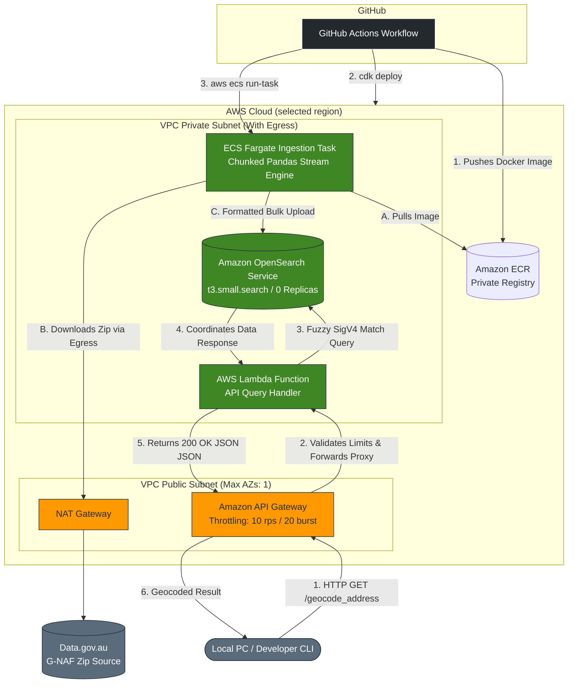

# Geocoder
Geocode Australian address from raw text

Deploy this to your AWS Account with Account ID and URL to latest GNAF dataset. Service is written in IaC (aws-cdk) for automatic deployment. Can then be destroyed when not needed.


    
## Pipeline
1. Downloads GNAF dataset from provided URL. This runs in a Fargate container, streaming the download to manage RAM
2. Process one state at a time and upload to OpenSearch
3. OpenSearch handels the address matching and similarity
4. API Gateway is created which routes to a lambda function to query OpenSearch

When deployed, users will recieve an API Gateway URL.
When requests are received they are sent to a lambda function which queries OpenSearch and returns the matches.

 ### Once deployed:
 To curl the API:
 ```curl -X GET "https://xxxxxxxxxx.execute-api.ap-southeast-2.amazonaws.com/prod/geocode_address?address=100+GeorgeSt+Sydney"```

## Deploying the App
Deploy with GitHub Actions, there is a deploy.yml, that creates the infrastucture in your AWS account. This runs the pipelines and creates the infrastructure, returning a URL link to send requests to.
Once you are done, run destroy.yml to teardown the infrustruction and not incur costs.

Three environment variables are required (assign in Secrets and varaibles):
1. AWS Account Number
2. AWS User Access Key
3. AWS User Access Secret

When deploying, there is a region parameter to deploy to your prefered region.

The API returns the 5 closest addresses to the users input, with the lat and long of the address.

Enjoy :)
